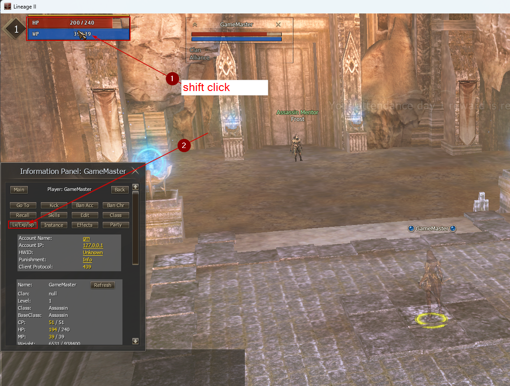
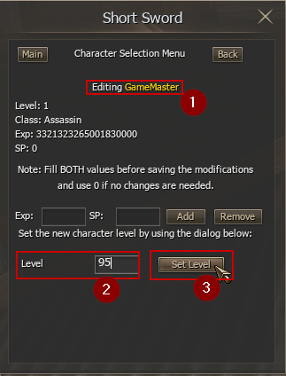
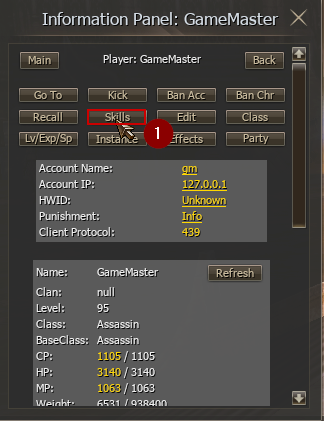
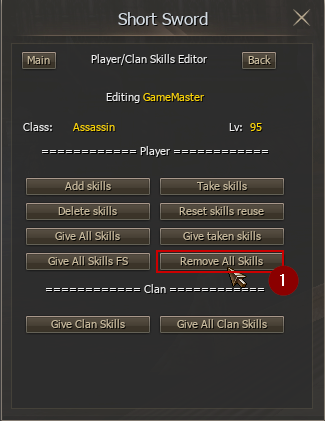
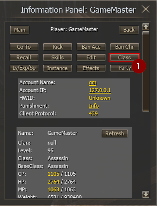
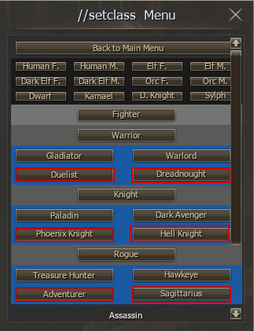
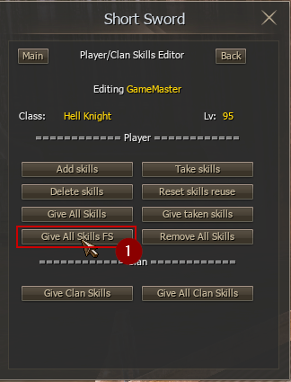
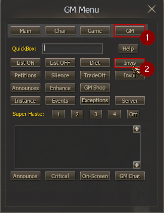

# Test Skill Procedure

## Tạo char lv1

## Set level lv99

## Xóa tất cả skills đang có (nếu char này đã có skill trong người)

## Chọn 1 class để test

## Học tất cả skills

## Treo farm 1 lúc

Turn of GM invi

cho adena (itemId 57)
mua vũ khí theo class, soul ore, soul shot, ... (mua shop)
Treo farm 30p
Check skill dùng được hay hông, skill countdown, skill effect, skill stat, enchant skill…

## Check Game Server log

## Test tiếp class khác

cần reset skills, reset class, trước khi test tiếp class khác
